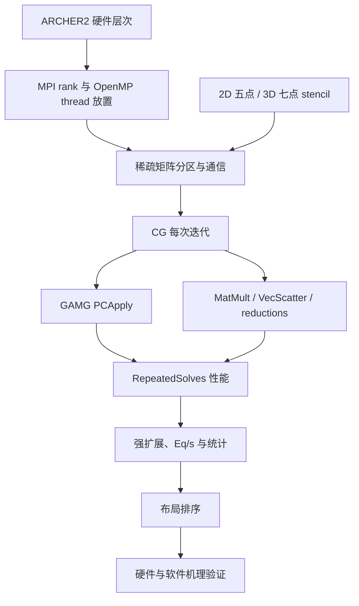

#course/dissertation #petsc #archer2 #type/index #status/review

> [!info] 知识图谱
> 研究对象：PETSc OpenMP backend 与 MPI-only 在 ARCHER2 上的强扩展表现  
> 论文材料：[[../04_synthesis_zh_mixed|综合稿]] · [[10 导师讨论速查|导师讨论速查]]

# PETSc-ARCHER2 性能研究知识图谱

这组笔记服务于一个具体问题：在每节点固定使用 128 个物理核心时，为什么不同的 MPI ranks/node × OpenMP threads/rank 布局会产生不同性能，并且 2D 与 3D 的最佳布局不同。

## 先知道研究在做什么

我们先把连续的Poisson偏微分方程离散成有限维线性方程组：

```text
A x = b
```

`A`是稀疏矩阵，`x`是要求的未知向量，`b`是已知右端项。PETSc负责存储矩阵和向量，并用CG迭代法与GAMG预条件器求解。MPI让多个进程协作处理分布式矩阵，OpenMP让一个进程内部的多个线程共享工作。实验改变每节点MPI进程数和每进程线程数，观察求解速度、通信和同步成本如何变化。

> [!summary]- 入门术语表
> | 术语 | 本笔记中的含义 |
> | --- | --- |
> | PETSc | Portable, Extensible Toolkit for Scientific Computation，用于并行科学计算的数值软件库 |
> | linear system | 线性方程组，写作 `Ax=b` |
> | solver | 求解未知向量 `x` 的算法及软件组件 |
> | MPI | Message Passing Interface，让多个独立进程通过消息交换数据 |
> | MPI rank | 一个MPI进程在通信组中的编号；本文也常用rank指代该进程 |
> | OpenMP | 一个进程内部的共享内存多线程编程模型 |
> | process / thread | 进程有独立地址空间；同一进程的线程共享该进程内存 |
> | node / core | node是一台计算服务器；core是CPU中执行指令的物理计算核心 |
> | layout | 每节点MPI ranks数 × 每rank OpenMP threads数，例如 `64×2` |
> | driver | 构造矩阵、调用PETSc并输出日志的测试程序 |
> | campaign | 按统一规则运行的一组实验 |
> | configuration | 一组确定的维度、规模、节点数和layout |
> | run / repeat | 一次程序执行；repeat是同一configuration的重复执行 |
> | profiling | 测量程序内部的时间、通信和硬件行为 |
> | Eq/s | equations per second，每秒完成的方程求解量，本文的应用吞吐量指标 |
> | iteration-normalised | 除以KSP迭代次数后的指标，用来减少迭代数差异的影响 |
> | MAP | Linaro Forge提供的并行性能分析器 |
> | strong scaling | 固定总问题规模，增加节点或核心，观察运行时间怎样缩短 |
> | warm-up / steady state | warm-up包含首次设置等一次性成本；steady state表示进入稳定重复执行后的成本 |



## 建议阅读顺序

### 初学路线

先理解问题和求解器，再进入并行、硬件和性能分析：

1. [[03 2D-3D Stencil 与稀疏矩阵]]
2. [[05 CG 与 GAMG]]
3. [[02 MPI-OpenMP 混合并行与布局]]
4. [[01 ARCHER2 硬件拓扑与线程绑定]]
5. [[04 矩阵分区 Halo 与通信]]
6. [[06 PETSc RepeatedSolves 与 Profiling]]
7. [[07 性能指标 强扩展与统计]]
8. [[09 2D 与 3D 差异分析框架]]
9. [[08 性能机理验证方法]]
10. [[10 导师讨论速查]]

### 会前速查路线

已经读过完整笔记时，按以下顺序复习：

1. [[10 导师讨论速查]]
2. [[09 2D 与 3D 差异分析框架]]
3. [[08 性能机理验证方法]]

## 当前论文已经建立的事实

| 项目 | 2D | 3D |
| --- | --- | --- |
| 正式配置 | 44 | 44 |
| 正式运行 | 132 | 132 |
| 每个配置重复数 | 3 | 3 |
| steady-state solves | 19 | 19 |
| raw-throughput 最常胜布局 | 64×2，8/11 点 | 32×4，6/11 点 |
| iteration-normalised 最常胜布局 | 64×2，11/11 点 | 32×4，7/11 点 |
| 16×8 | 11/11 点最低 | 0 个胜点 |
| 最大点的 64×2 | 794.8 M Eq/s | 510.4 M Eq/s |
| 相对 128×1 | +13.1% | +30.1% |

> [!warning]- 证据边界
> 当前数据建立了布局与性能之间的稳定关联，没有证明完整的硬件因果机制。三次重复只支持报告中位数与观测范围，不支持强统计显著性结论。MAP测量会给程序增加较大且不均匀的开销，不能把带MAP的时间与不带profiler的正式scaling时间混合。

## 核心判断链

```text
最终 KSPSolve 时间
  = 迭代次数
  × 每次迭代时间

每次迭代时间
  ≈ MatMult + PCApply + 向量运算 + 全局归约 + 等待/不平衡
```

分析任何性能差异时，先判断它来自迭代次数，还是每次迭代成本。之后再把每次迭代拆成 PETSc events。

## 原始材料

- [中文综合稿](../04_synthesis_zh_mixed.md)
- [论文 LaTeX](../../dissertation_latex/draft.tex)
- [2D campaign record](../../../analysis/data/nproc_2d_libsci/reports/README.md)
- [3D campaign record](../../../analysis/data/nproc_3d_libsci/reports/README.md)
