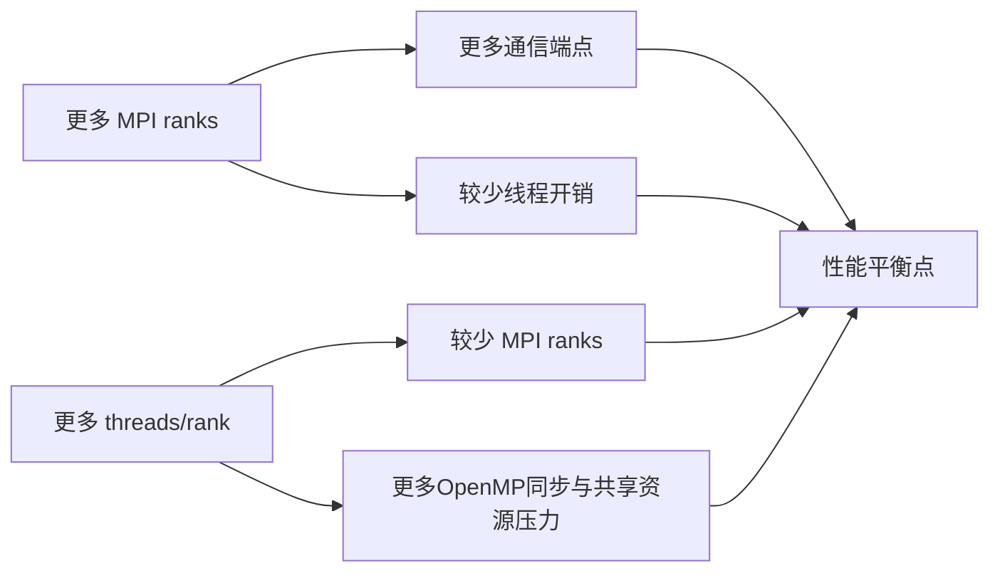

#course/dissertation #mpi #openmp #hybrid #type/concept #status/review

> [!info] 知识图谱
> 前置：[[05 CG 与 GAMG]]  
> 后续：[[01 ARCHER2 硬件拓扑与线程绑定]] · [[04 矩阵分区 Halo 与通信]]

# MPI-OpenMP 混合并行与布局

## 一、两种并行模型

MPI（Message Passing Interface）把工作分给多个独立进程。每个进程拥有自己的地址空间，进程之间通过发送和接收消息交换数据。MPI rank是进程在通信组中的编号。

OpenMP把一个进程内部的工作分给多个线程。同一进程中的线程共享内存，因此可以直接读取同一个矩阵和向量，但需要同步以避免线程在数据尚未准备好时继续执行。

```text
MPI：多个进程 + 独立内存 + 消息通信
OpenMP：一个进程内多个线程 + 共享内存
Hybrid：每节点运行多个MPI进程，每个进程再启动多个OpenMP线程
```

同步（synchronization）表示某些执行流必须等待其他进程或线程到达指定状态。通信端点（endpoint）是参与一次通信的进程一端；MPI ranks增多时，潜在通信端点通常也会增多。

## 二、三个不能混淆的数量

| 名称 | 含义 | 本项目中的计算 |
| --- | --- | --- |
| MPI ranks/node | 每节点MPI进程数 | 128、64、32、16 |
| threads/rank | 每个进程的OpenMP线程数 | 1、2、4、8 |
| cores/node | 每节点使用的物理核心数 | ranks/node × threads/rank = 128 |

总 MPI process 数：

```text
total NPROC = nodes × MPI ranks/node
```

例如16节点的64×2布局：

```text
MPI ranks/node       = 64
OpenMP threads/rank  = 2
cores/node           = 128
total NPROC          = 16 × 64 = 1024
total physical cores = 16 × 128 = 2048
```

NPROC图的横轴应使用PETSc实际报告的MPI进程数，不是总线程数。

## 三、MPI-only 与 hybrid 的权衡

增加 MPI ranks 通常会：

- 缩小每个rank的本地矩阵；
- 增加MPI endpoints和潜在消息数量；
- 减少每个rank内部的线程工作；
- 避免OpenMP同步与线程调度成本。

增加每rank的OpenMP threads通常会：

- 减少MPI ranks和通信端点；
- 增大每个rank拥有的数据；
- 增加线程并行、同步和共享缓存压力；
- 可能跨越CCX或NUMA边界。

所以最佳点常出现在中度hybrid布局。这个判断仍依赖具体矩阵、PETSc事件和硬件放置。



## 四、正式运行中的绑定参数

```bash
export OMP_NUM_THREADS="${THREADS}"
export OMP_PLACES=cores
export OMP_PROC_BIND=close
export OMP_DYNAMIC=FALSE

srun --ntasks="${NPROC}" \
     --ntasks-per-node="${PPN}" \
     --cpus-per-task="${THREADS}" \
     --exact \
     --hint=nomultithread \
     --distribution=block:block \
     --cpu-bind=cores
```

| 设置 | 目的 |
| --- | --- |
| `OMP_NUM_THREADS` | 固定每个rank的线程数 |
| `OMP_PLACES=cores` | 以物理核心作为OpenMP place |
| `OMP_PROC_BIND=close` | 让同一线程团队优先使用相邻places |
| `OMP_DYNAMIC=FALSE` | 禁止runtime动态改变线程数 |
| `--cpus-per-task` | 为每个MPI task分配对应CPU资源 |
| `--hint=nomultithread` | 不使用SMT的第二硬件线程 |
| `--distribution=block:block` | 按节点连续分配tasks |
| `--cpu-bind=cores` | 将tasks绑定到核心集合 |

> [!warning]- 环境变量不是运行证据
> 脚本写了 `OMP_PROC_BIND=close`，只能证明意图。必须用日志中实际进程/线程数以及 `xthi` 或CPU mask确认运行时行为。

## 五、怎样解释当前排序

2D中，64×2在raw throughput上赢8/11点，在iteration-normalised指标上赢11/11点。说明两线程布局在当前五点矩阵和GAMG配置中提供了稳定平衡。

3D中，32×4赢6个raw-throughput点，64×2赢4个。3D并不存在一个覆盖所有规模的唯一最佳布局。32×4与64×2都应作为候选。

16×8没有赢过任何2D或3D点。安全结论是“8 threads/rank在该工作负载中缺少收益证据”。没有profiling证据前，不应把原因直接写成NUMA、缓存或OpenMP同步。

## 六、常见错误

> [!warning]- 易错点
> 1. 把 `64×2` 解释为总共64个MPI进程。它表示每节点64个。  
> 2. 把NPROC当成总核心数。hybrid布局中两者不同。  
> 3. 比较不同布局时没有保持每节点128核心。  
> 4. 只看MPI通信减少，不看OpenMP同步增加。  
> 5. 从脚本参数推断实际放置，而没有保存affinity证据。

## 速查

| 布局 | ranks/node | threads/rank | cores/node |
| --- | ---: | ---: | ---: |
| 128×1 | 128 | 1 | 128 |
| 64×2 | 64 | 2 | 128 |
| 32×4 | 32 | 4 | 128 |
| 16×8 | 16 | 8 | 128 |

## 自测

> [!example]- 16节点的64×2布局有多少MPI进程和物理核心？
> 总MPI进程数是 `16×64=1024`，总物理核心数是 `16×128=2048`。

> [!example]- 为什么减少MPI ranks不一定更快？
> ranks减少可能降低消息和通信端点数量，但每个rank需要更多OpenMP线程，线程同步、共享cache和内存带宽成本可能上升。

> [!example]- rank、thread和core是什么关系？
> rank是MPI进程，thread是进程内部的执行流，core是运行它们的硬件。软件实体需要通过affinity映射到具体核心。
