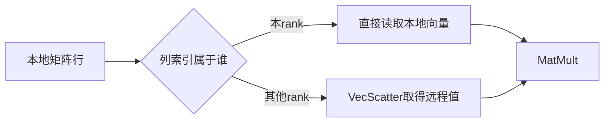

#course/dissertation #mpi #partitioning #halo #petsc #type/concept #status/review

> [!info] 知识图谱
> 前置：[[03 2D-3D Stencil 与稀疏矩阵]] · [[01 ARCHER2 硬件拓扑与线程绑定]]  
> 后续：[[06 PETSc RepeatedSolves 与 Profiling]] · [[09 2D 与 3D 差异分析框架]]

# 矩阵分区、Halo 与通信

## 读前概念

全局矩阵是整个 `Ax=b` 系统。并行运行时，每个MPI rank只保存和计算其中一部分，这一部分称为本地数据。分区（partitioning）决定每个rank拥有哪些矩阵行；通信负责取得本地计算缺少的远程向量元素。

## 一、并行稀疏矩阵怎样分配

PETSc给每个MPI rank一段全局矩阵行：

```text
rank r owns rows [Istart, Iend)
```

rank可以直接访问本地输入向量元素。某一行引用其他rank拥有的列时，MatMult必须先取得对应的远程向量值。



## 二、Halo/Ghost值

Halo或ghost值是当前rank计算本地结果时需要、但由其他rank拥有的数据副本。

一次典型交换包括：

1. 确定需要哪些远程向量元素；
2. 发起非阻塞通信；
3. 尽可能计算本地部分；
4. 等待远程数据；
5. 完成涉及off-diagonal block的计算。

PETSc日志中的 `VecScatterBegin` 和 `VecScatterEnd` 对应这类通信。PETSc官方说明 `MatMult` 的通信包含这些scatter事件：[PETSc Profiling](https://petsc.org/release/manual/profiling/)

> [!warning]- 不要把嵌套事件时间相加
> `MatMult`包含`VecScatter`。把MatMult时间和VecScatter时间直接相加会重复计算。应把VecScatter看成MatMult内部成本的分解。

## 三、通信成本的组成

一个简化模型是：

```text
communication time ≈ number of messages × latency
                   + transferred bytes / bandwidth
                   + waiting caused by imbalance
```

少量大消息和大量小消息即使总字节数相同，成本也可能不同。`VecScatterEnd`较高也不等于网络本身很慢：接收方可能在等待较慢的rank到达通信点。

## 四、连续行分区对当前driver的影响

当前2D/3D driver没有构造处理器笛卡尔网格。每个rank拥有连续线性编号，所以通信边界取决于：

- 每个rank的行区间长度；
- stencil邻居的线性偏移；
- 行区间边界是否切断这些偏移；
- GAMG粗层矩阵的重新分布。

2D偏移是 `±1, ±n`，3D偏移是 `±1, ±m, ±m×n`。当某个偏移大于每rank拥有的行数时，大量邻接关系可能变成off-process访问。必须测量实际通信，不能只凭几何直觉判断。

## 五、怎样测量

### 使用现有 `-log_view`

在 `RepeatedSolves` stage提取：

| 指标 | 解释 |
| --- | --- |
| MatMult count/time/flops | SpMV调用次数与总成本 |
| VecScatterBegin/End time | 数据交换与等待 |
| message count | 通信频率 |
| average message length | 消息粒度 |
| reductions | 全局同步数量 |

所有指标都应除以总KSP iterations，才能比较不同迭代次数的布局。

### 查看scatter结构

PETSc并行AIJ矩阵支持：

```text
-matmult_vecscatter_view
```

它可以显示MatMult使用的rank-to-rank scatter结构。小规模代表点适合查看完整图；大规模运行应避免把完整通信矩阵打印到标准输出。

来源：[PETSc MatCreateAIJ](https://petsc.org/release/manualpages/Mat/MatCreateAIJ/)

### 记录矩阵信息

至少记录：

- global rows与columns；
- global nonzeros；
- diagonal/off-diagonal nonzeros；
- 每个rank的local rows；
- MatMult消息数量和总字节量。

## 六、布局为什么改变通信

固定总未知数和节点数时：

```text
更多 MPI ranks
  ⇒ 每rank拥有更少矩阵行
  ⇒ 更多partition boundaries
  ⇒ 可能增加消息数量

更多 threads/rank
  ⇒ 更少MPI ranks
  ⇒ 每rank拥有更多矩阵行
  ⇒ 可能减少消息端点
  ⇒ 同时增加线程与缓存成本
```

“可能”不能省略。GAMG粗层、矩阵结构和PETSc实现都可能改变简单趋势。

## 速查

| 术语 | 一句话定义 |
| --- | --- |
| ownership range | rank拥有的连续全局行区间 |
| diagonal block | 列也由当前rank拥有的矩阵部分 |
| off-diagonal block | 需要远程向量值的矩阵部分 |
| halo/ghost | 本地计算缓存的远程数据副本 |
| VecScatter | PETSc的数据重分布/远程值交换 |
| latency | 每条消息的固定启动成本 |
| bandwidth | 单位时间可传输的数据量 |
| imbalance | ranks到达同步点的时间不一致 |

## 自测

> [!example]- diagonal block与off-diagonal block的区别是什么？
> diagonal block引用当前rank拥有的向量元素；off-diagonal block引用其他rank拥有的元素，需要通信取得数据。

> [!example]- 为什么`VecScatterEnd`时间高不能直接证明网络慢？
> 它可能包含等待较慢rank到达通信点的时间。网络传输、计算不平衡和同步等待都可能影响该事件。

> [!example]- 为什么更多MPI ranks可能增加通信成本？
> 每rank拥有的行数减少，分区边界增多，远程引用和小消息数量可能随之增加。
