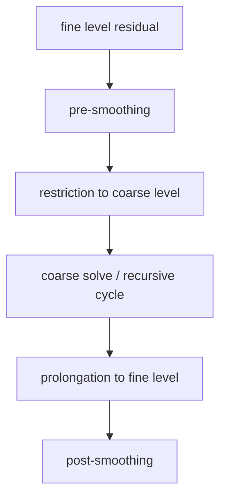

#course/dissertation #petsc #ksp/cg #gamg #multigrid #type/concept #status/review

> [!info] 知识图谱
> 前置：[[03 2D-3D Stencil 与稀疏矩阵]]  
> 后续：[[02 MPI-OpenMP 混合并行与布局]] · [[06 PETSc RepeatedSolves 与 Profiling]]

# CG 与 GAMG

## 读前概念

PETSc把线性迭代求解器统一放在KSP（Krylov Subspace Methods）组件中，把预条件器放在PC（Preconditioner）组件中。命令行选项 `-ksp_type cg -pc_type gamg` 表示使用CG求解器和GAMG预条件器。

| 术语 | 含义 |
| --- | --- |
| iteration | 求解器重复执行的一轮更新 |
| residual | 当前近似解的方程误差，`r=b-Ax` |
| convergence | residual达到容差要求，求解器停止 |
| dot product | 两个向量对应元素乘积的总和 |
| norm | 衡量向量整体大小的数值 |
| global reduction | 所有MPI ranks共同参与的汇总，例如计算全局dot product |
| preconditioner | 改造求解问题，使迭代更快收敛的辅助算子 |

## 一、为什么使用 CG

2D五点和3D七点Poisson矩阵被标记为对称矩阵。实验通过命令行选择：

```text
-ksp_type cg
-pc_type gamg
```

Conjugate Gradient（CG）用于对称正定线性系统。每次迭代主要包含：

- 一个或多个稀疏矩阵向量乘；
- 预条件器应用；
- 向量更新；
- dot products与norms；
- dot/norm引起的MPI全局归约。

这里不需要背每个PETSc内部函数的固定次数。不同PETSc实现和选项可能改变调用结构，应以 `-log_view` 的event count为准。

对称正定（symmetric positive definite，SPD）表示矩阵满足 `A=Aᵀ`，并且对任何非零向量 `z` 都有 `zᵀAz>0`。CG依赖这一性质。当前driver把Poisson矩阵标记为对称，并使用CG；正式日志中的收敛结果用于确认该配置实际成功求解。

## 二、预条件的作用

CG求解：

```text
A x = b
```

预条件器构造一个容易应用的近似逆，使预条件后的系统更容易迭代收敛。性能取决于两件事：

```text
预条件器质量：减少多少KSP iterations
预条件器成本：每次PCApply需要多少时间
```

更强的预条件器可能减少迭代，却增加每次迭代成本。因此不能只比较iterations。

## 三、GAMG是什么

GAMG是PETSc的algebraic multigrid预条件器。它从矩阵图构造多层问题，不要求用户显式提供规则几何网格。

多重网格的直觉是：细网格适合处理局部、快速变化的误差；粗网格用更少未知量表示大尺度误差。一次V-cycle在不同层之间传递残差和修正。

一个典型V-cycle包括：



| 组件 | 作用 | 可能成本 |
| --- | --- | --- |
| smoother | 消除高频误差 | MatMult、local solve、线程成本 |
| restriction | 把残差传到粗层 | 稀疏运算与通信 |
| coarse solve | 处理低频误差 | 小矩阵、同步、rank利用率下降 |
| prolongation | 把修正传回细层 | 稀疏运算与通信 |

这里的aggregation把多个细层未知量组合成粗层节点；restriction把细层残差传到粗层；prolongation把粗层修正插值回细层；smoother用少量局部迭代削弱细层上快速变化的误差。

PETSc的multigrid选项与日志入口见：[PETSc PCMG](https://petsc.org/release/manualpages/PC/PCMG/)

## 四、Setup 与 Apply 必须分开

### PCSetUp

GAMG setup可能执行：

- 矩阵图处理和aggregation；
- interpolation/restriction构造；
- coarse operators构造；
- coarse solver设置。

这些工作只在第一次solve的Main Stage中支付。

### PCApply

每次CG迭代都会应用已经建立好的GAMG hierarchy。正式吞吐量测量只包含RepeatedSolves，因此主要观察PCApply，而不是PCSetUp。

> [!warning]- 论文结论范围
> 当前结果回答“重复求解同一operator、复用GAMG hierarchy时哪个布局更快”。它不回答“一次性求解包含setup时哪个布局最好”。如需后者，必须单独分析Main Stage和PCSetUp。

## 五、为什么2D和3D迭代次数不同

当前数据：

```text
2D：9–13 iterations
3D：6–7 iterations
```

可能影响GAMG迭代数的因素包括：

- 五点和七点矩阵图不同；
- aggregation和粗层算子不同；
- MPI分区改变矩阵图边界；
- 不同粗层的rank布局；
- 收敛容差和谱性质。

现有结果不能把6–7与9–13归因于某一个因素。需要 `-ksp_view`、multigrid level信息和per-level profiling。

## 六、正确的性能分解

```text
KSPSolve time
  = iterations × seconds/iteration

seconds/iteration
  ≈ MatMult/iteration
   + PCApply/iteration
   + vector operations/iteration
   + reductions/iteration
   + runtime waiting
```

当某个布局raw Eq/s较高，先检查：

1. 它是否只是少做了一次迭代；
2. 它的seconds/iteration是否也更低；
3. 改善来自MatMult还是PCApply；
4. message/reduction和线程开销是否同步变化。

## 七、查看求解器配置

代表点可以加入：

```text
-ksp_view
-pc_mg_log
```

记录：

- KSP和PC类型；
- multigrid levels；
- 每层solver/smoother；
- 每层时间和通信；
- coarse grid使用的MPI ranks。

## 速查

| 指标 | 高或低意味着什么 |
| --- | --- |
| iterations | 预条件后的算法收敛工作量 |
| seconds/iteration | 每次迭代的实现成本 |
| PCSetUp | 构造GAMG hierarchy的成本 |
| PCApply | 使用GAMG hierarchy的成本 |
| MatMult | 稀疏矩阵向量乘成本 |
| global reductions | CG的全局同步成本 |

## 自测

> [!example]- 为什么iterations少不一定代表运行更快？
> 更强的预条件器可能减少iterations，但每次PCApply更贵。总时间取决于迭代次数和每次迭代时间的乘积。

> [!example]- global reduction为什么会限制强扩展？
> 所有ranks都要贡献数据并等待全局结果。rank数量增多或负载不平衡时，同步成本可能变得明显。

> [!example]- PCSetUp与PCApply分别做什么？
> PCSetUp构造GAMG层次；PCApply在每次CG迭代中使用已经构造好的层次。
