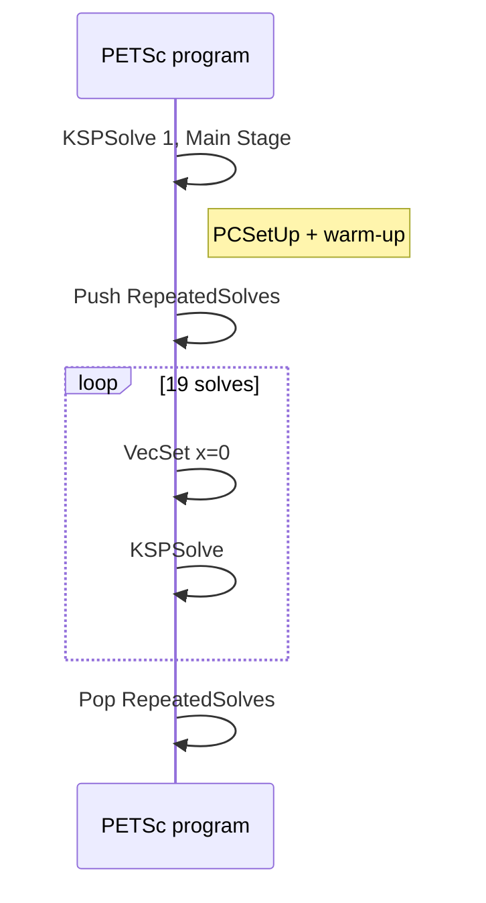

#course/dissertation #petsc #profiling #forge/map #type/method #status/review

> [!info] 知识图谱
> 前置：[[05 CG 与 GAMG]] · [[04 矩阵分区 Halo 与通信]]  
> 后续：[[07 性能指标 强扩展与统计]] · [[08 性能机理验证方法]]

# PETSc RepeatedSolves 与 Profiling

## 读前概念

| 术语 | 本项目中的含义 |
| --- | --- |
| build | 使用一组编译器、优化和库选项生成的软件版本 |
| executable / binary | 编译完成后由Slurm实际启动的程序文件 |
| `PETSC_ARCH` | PETSc编译配置及输出目录的名称，不是CPU硬件架构本身 |
| stage | 程序员划定的一段测量区间，例如 `RepeatedSolves` |
| event | PETSc记录的一类操作，例如 `MatMult`或`PCApply` |
| profiler | 记录函数时间、通信或硬件指标的性能分析工具 |
| Slurm | ARCHER2的作业调度系统，负责分配节点并启动作业步骤 |
| `srun` | Slurm在已分配节点上启动并行程序的命令 |
| instrumentation | profiler加入的测量工作；它本身可能改变运行时间 |
| call path | 从上层函数到实际热点函数的调用链 |
| BLAS | Basic Linear Algebra Subprograms，基础线性代数函数接口 |
| LibSci | ARCHER2提供的科学计算数学库，包含BLAS等实现 |
| SONAME | 动态链接器用于识别共享库版本的名称 |
| MAP | Linaro Forge中的并行性能分析器 |

## 一、为什么需要RepeatedSolves阶段

每次程序执行20次KSPSolve：

```text
solve 1      Main Stage
             warm-up + PCSetUp + first-touch等一次性成本

solve 2–20   RepeatedSolves Stage
             19次steady-state solves
             复用preconditioner和GAMG interpolation
```

正式性能比较只读取 `RepeatedSolves`。Main Stage包含一次性setup和冷启动行为，不能与steady-state时间混合。



## 二、日志必须验证什么

每个正式日志应满足：

- PETSc报告的arch正确；
- MPI进程数和OpenMP线程数与请求一致；
- 共20次收敛solve；
- `RepeatedSolves`中的KSPSolve count为19；
- `RepeatedSolves`中没有真正的PCSetUp；
- timing为正；
- 没有PETSc/MPI/Slurm错误；
- LibSci实验中链接路径确实指向目标SONAME。

文件名和脚本变量不是运行证据，应以日志内容为准。

## 三、`-log_view` 怎么读

PETSc将event统计按stage输出。常用事件：

| Event | 含义 |
| --- | --- |
| KSPSolve | 整个KSP求解，包括子事件 |
| MatMult | 稀疏矩阵向量乘 |
| PCApply | 预条件器应用 |
| VecScatterBegin/End | 远程向量值交换与等待 |
| VecTDot / VecNorm | 内积、范数与全局归约 |
| VecAXPY等 | 本地向量操作 |

常见列：

| 列 | 含义 |
| --- | --- |
| Count | event调用次数 |
| Time | 各rank中的最大或汇总时间，按输出定义读取 |
| Flop | 浮点工作量 |
| Mess | MPI消息 |
| AvgLen | 平均消息长度 |
| Reduct | 全局归约 |
| `%T/%F/%M/%L/%R` | 相对当前stage或全程序的占比 |

PETSc把 `-log_view` 定位为低开销的主要profiling方式：[PETSc Profiling](https://petsc.org/release/manual/profiling/)

> [!warning]- 百分比会受分母影响
> 一个event的绝对时间没有变化，其他event变快后，它的 `%T` 也会升高。解释布局差异时同时报告绝对时间/iteration和stage占比。

## 四、事件层次与重复计时

高层event包含子event：

```text
KSPSolve
├── MatMult
│   └── VecScatter
├── PCApply
└── Vec operations / reductions
```

这些时间用于分解“父event内部花在哪里”，不能简单求和。需要明确写“MatMult中有多少时间与VecScatter相关”，而不是“MatMult加VecScatter等于总时间”。

## 五、MAP能回答什么

Linaro MAP可以观察：

- MPI time和调用路径；
- OpenMP worker activity与同步；
- memory operations和cache相关指标；
- 进程或线程之间的不平衡；
- 函数/源代码行热点。

来源：[Linaro MAP](https://docs.linaroforge.com/26.0/html/forge/forge/introduction_to_forge/map.html)

### 本项目的限制

> [!warning]- MAP使用规则
> 1. MAP instrumentation overhead很大且不均匀。  
> 2. MAP timings不得放入uninstrumented scaling曲线。  
> 3. MAP不能可靠启动128 MPI ranks/node，因此128×1只能使用`-log_view`。  
> 4. MAP affinity报错可能是sampler artifact，实际绑定以`srun`/`xthi`为准。  
> 5. 只比较同一MAP campaign、同一stage内的指标。

现有baseline MAP矩阵包含128×1、32×4和16×8，但128×1只有PETSc日志。它可以帮助分析32×4与16×8，不能解释2D中64×2为什么最优，因为该布局没有对应profile。

## 六、LibSci与BLAS归因

```text
链接到 threaded LibSci
  ≠ RepeatedSolves 实际调用了BLAS
  ≠ LibSci导致布局排序
```

归因需要MAP call path或符号级证据。当前smoke结果显示RepeatedSolves路径没有可观察的BLAS作用时，应把“no-BLAS solve path”报告为结果，而不是把它当作实验失败。

## 七、推荐的event归一化表

每个配置生成：

```text
event_time_per_iteration = event_time / total_iterations
messages_per_iteration   = messages / total_iterations
bytes_per_iteration      = message_bytes / total_iterations
flops_per_iteration      = flops / total_iterations
```

表格至少包含：

| dimension | scale | nodes | layout | iterations | MatMult/iter | PCApply/iter | VecScatterEnd/iter | reductions/iter |
| --- | --- | ---: | --- | ---: | ---: | ---: | ---: | ---: |

## 考点归纳

| 题目 | 应回答 |
| --- | --- |
| 为什么排除Main Stage | 包含PCSetUp、warm-up和first-touch |
| 为什么用RepeatedSolves | 表示复用preconditioner后的steady-state成本 |
| MAP时间能否放入scaling图 | 不能，开销大且不均匀 |
| MatMult和VecScatter能否相加 | 不能，父子event会重复计时 |
| 链接LibSci是否证明BLAS生效 | 不能，需要call-path证据 |

## 自测

> [!example]- 为什么不能用Main Stage比较steady-state布局性能？
> Main Stage包含PCSetUp、first-touch和首次执行成本；RepeatedSolves才是复用GAMG层次后的稳定求解阶段。

> [!example]- 为什么MatMult时间和VecScatter时间不能直接相加？
> VecScatter是MatMult内部的子事件。两者相加会重复计算同一段时间。

> [!example]- binary链接了threaded LibSci，能否证明RepeatedSolves使用BLAS？
> 不能。链接只表示函数可用；需要MAP call path或符号级证据证明该阶段实际调用了BLAS。
