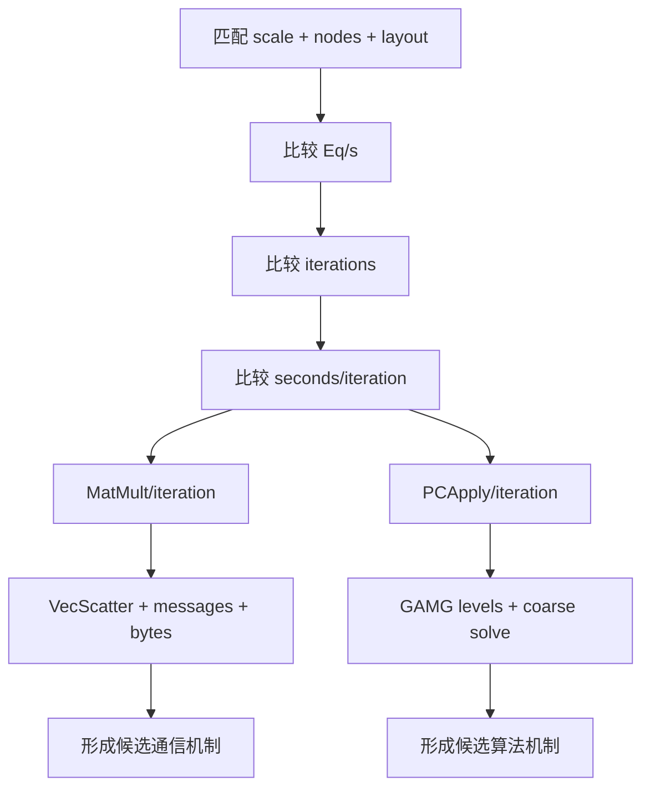

#course/dissertation #2d #3d #comparison #petsc #type/analysis #status/review

> [!info] 知识图谱
> 前置：[[03 2D-3D Stencil 与稀疏矩阵]] · [[04 矩阵分区 Halo 与通信]] · [[05 CG 与 GAMG]] · [[07 性能指标 强扩展与统计]]  
> 后续：[[08 性能机理验证方法]] · [[10 导师讨论速查]]

# 2D 与 3D 差异分析框架

## 读前概念

Matched comparison表示只比较scale、nodes和layout相同的2D/3D配置。Ratio表示两个匹配值的比值，例如 `3D seconds/iteration ÷ 2D seconds/iteration`。比值大于1表示3D更高，小于1表示3D更低；它描述相对差异，不自动给出原因。

## 一、比较目的

跨维度分析应回答两个问题：

1. 相同硬件资源下，2D与3D对MPI/OpenMP布局的敏感性是否不同？
2. 差异来自每个方程的工作量、通信、GAMG迭代数，还是每次迭代实现成本？

不要把问题简化成“2D与3D谁更快”。五点与七点矩阵的单方程成本不同。

## 二、可比条件与不可消除差异

### 可控制条件

| 条件 | 当前设计 |
| --- | --- |
| scale/unknowns | 标签匹配，实际unknowns非常接近 |
| nodes | 相同 |
| cores/node | 128 physical cores |
| layouts | 128×1、64×2、32×4、16×8 |
| solver | CG+GAMG |
| solves | 1 warm-up + 19 timed |
| build | 相同LibSci-linked PETSc arch |
| repeat protocol | 每配置3次正式运行 |

两个driver还使用相同的求解语义：精确解向量设为全1，通过 `b=A×1` 构造右端项；每次RepeatedSolves前把初始解重新置零。收敛容差分别按二维和三维网格尺寸设置，量级都接近问题未知数的倒数，但公式并非逐点完全相同：

```text
2D rtol = 1e-2 / ((m+1)(n+1))
3D rtol = 1e-2 / ((m+1)(n+1)(p+1))
```

正式跨维度表应把实际rtol列出，避免把求解停止条件差异遗漏在比较之外。

### 问题本身的差异

| 维度 | 2D | 3D |
| --- | --- | --- |
| stencil | 五点 | 七点 |
| nonzeros/row | 最多5 | 最多7 |
| 线性邻居偏移 | ±1、±n | ±1、±m、±m×n |
| observed iterations | 9–13 | 6–7 |
| 单次MatMult工作 | 较少 | 通常较多 |
| 分区后的通信图 | 需要测量 | 需要测量 |

## 三、当前结果的安全结论

### 2D

- 64×2赢8/11个raw-throughput点；
- 128×1赢其余3点；
- iteration-normalised后64×2赢11/11点；
- 16×8在11点全部最低；
- 165m/32 nodes时64×2达到约794.8 M Eq/s，比128×1高13.1%。

### 3D

- 32×4赢6/11个raw-throughput点；
- 64×2赢4点；
- 128×1赢1点；
- iteration-normalised后32×4赢7点、64×2赢3点；
- 16×8没有胜点；
- 165m/32 nodes时64×2达到约510.4 M Eq/s，比128×1高30.1%。

### 跨维度

安全解释是：

> 两个维度都偏好中度hybrid布局，但平衡点不同。2D稳定偏好2 threads/rank；3D更常从4 threads/rank获益，同时最大规模点仍由64×2胜出。这表明矩阵工作量、实际通信图和GAMG行为共同改变了MPI端点减少与OpenMP成本之间的平衡。

不能直接说：

- 3D因为表面积更大所以32×4更好；
- 2D因为缓存更好所以64×2更好；
- 3D Eq/s更低就代表实现效率更低；
- LibSci导致2D与3D排序不同。

## 四、数据分解顺序



按这个顺序可以避免把迭代数差异误认为硬件差异。

## 五、建议生成的三张跨维度图

### 图A：Matched Eq/s ratio

```text
y = 3D Eq/s / 2D Eq/s
x = matched scale-node points
colour = layout
```

用途：显示应用吞吐量差异。图注必须说明五点和七点每个equation工作量不同。

### 图B：Matched seconds/iteration ratio

```text
y = 3D seconds/iteration / 2D seconds/iteration
```

用途：移除迭代次数差异，观察每次迭代成本。

### 图C：Event-level breakdown

```text
MatMult/iteration
PCApply/iteration
VecScatterEnd/iteration
other KSP time/iteration
```

用途：判断差异主要来自SpMV、预条件器还是等待。

> [!warning]- 不要手工编辑derived CSV或plots
> 修改analysis script，再运行脚本生成所有派生表和图片。原始logs与source CSV必须保持byte-for-byte不变。

## 六、需要补充测量的项目

优先级从高到低：

1. 从现有正式日志解析2D/3D event time、messages和reductions；
2. 保存四种布局的xthi放置证据；
3. 在代表点记录 `-ksp_view` 与GAMG level信息；
4. 小规模查看 `-matmult_vecscatter_view`；
5. 如需解释64×2，补充对应profile；
6. 只有导师要求推广到几何stencil程序时，再考虑DMDA对照实验。

## 七、DMDA对照实验回答什么

当前driver使用连续矩阵行分区。DMDA对照可以回答：

```text
观察到的2D/3D布局差异
  是当前线性行分区的结果
  还是在几何笛卡尔分区下仍然存在
```

增加DMDA会改变研究范围和实现，不应在导师确认前直接加入正式campaign。

## 八、论文措辞模板

> The matched campaigns show that both dimensions favour moderate hybridisation, but the preferred balance differs. The 2D system consistently favours 64 MPI ranks per node with two threads per rank after iteration normalisation, whereas the 3D system more often favours 32 ranks with four threads. Because the drivers use contiguous matrix-row ownership rather than a Cartesian DMDA decomposition, the present data do not support a purely geometric surface-to-volume explanation. Event-level communication and multigrid measurements are required to distinguish matrix, partitioning and runtime effects.

## 复习问题

> [!example]- 为什么不能直接比较2D和3D Eq/s判断实现效率？
> 3D七点矩阵每行通常比2D五点矩阵多两个非零元，所以一个equation对应的内存和计算工作不同。应同时比较seconds/iteration、MatMult、PCApply、flops和通信。

> [!example]- 为什么3D iterations更少却可能总吞吐量更低？
> 总时间等于迭代次数乘每次迭代成本。3D只做6–7次迭代，但每次迭代可能显著更贵。

> [!example]- 为什么不能直接使用surface-to-volume解释？
> 当前driver按连续矩阵行分区，没有显式构造二维或三维笛卡尔子域。实际off-process非零元和scatter图需要测量。
