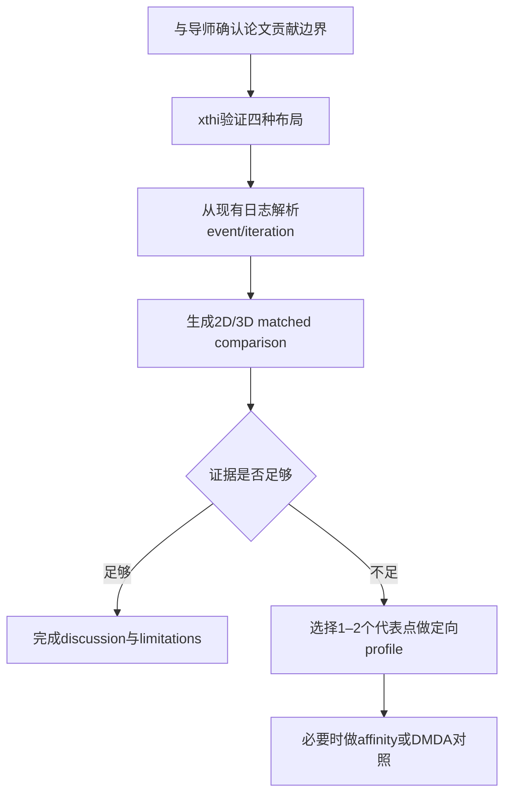

#course/dissertation #supervision #meeting #type/review #status/ready

> [!info] 知识图谱
> 前置：[[00 PETSc-ARCHER2 性能研究知识图谱]] · [[08 性能机理验证方法]] · [[09 2D 与 3D 差异分析框架]]  
> 用途：导师会议前快速复习

# 导师讨论速查

## 一、60秒研究陈述

本研究比较PETSc OpenMP backend与MPI-only在ARCHER2上的强扩展表现。正式2D和3D campaigns都使用每节点128个物理核心，测试128×1、64×2、32×4和16×8四种布局。每次运行先完成一次包含GAMG setup的warm-up solve，再测量19次复用preconditioner的RepeatedSolves。

2D中64×2在按迭代归一化后赢全部11个点。3D更常由32×4获胜，但最大规模点仍由64×2获胜。两个维度都说明中度hybrid优于8 threads/rank，不过最佳平衡随矩阵结构和规模改变。当前证据可靠地建立了性能排序，还没有证明完整硬件机制。

## 二、2D与3D的30秒解释

2D是五点矩阵，3D是七点矩阵，所以每个3D equation通常需要更多稀疏矩阵工作。3D每次迭代明显更贵，但只需要6–7次迭代；2D需要9–13次。两个driver采用PETSc连续矩阵行分区，不是DMDA笛卡尔分区。因此我准备从MatMult、VecScatter、PCApply、实际消息和GAMG层次解释差异，而不直接套用标准surface-to-volume模型。

## 三、必须记住的数字

| 项目 | 2D | 3D |
| --- | ---: | ---: |
| 正式runs | 132 | 132 |
| configurations | 44 | 44 |
| iterations | 9–13 | 6–7 |
| raw winners | 64×2: 8；128×1: 3 | 32×4: 6；64×2: 4；128×1: 1 |
| normalised winners | 64×2: 11 | 32×4: 7；64×2: 3；128×1: 1 |
| 16×8 wins | 0 | 0 |
| 165m/32 nodes，64×2 | 794.8 M Eq/s | 510.4 M Eq/s |
| 相对128×1 | +13.1% | +30.1% |
| 最大repeat spread | 4.71% | 3.83% |

## 四、六个必须能解释的概念

### 1. 64×2是什么意思

每节点64个MPI ranks，每rank两个OpenMP threads，总计使用128个物理核心。总NPROC还要乘节点数。

### 2. 为什么只使用RepeatedSolves

第一次solve包含PCSetUp、first-touch和warm-up。RepeatedSolves测量复用GAMG hierarchy后的steady-state solve成本。

### 3. Eq/s怎么算

```text
Eq/s = unknowns × 19 / RepeatedSolves KSPSolve max time
```

### 4. 为什么还要seconds/iteration

GAMG迭代数随布局变化。seconds/iteration用于判断性能优势是否只是少做迭代。

### 5. 为什么2D/3D Eq/s不能直接当效率比较

五点和七点矩阵的nonzeros与单方程工作量不同。

### 6. 为什么当前不能声称NUMA或CCX因果关系

脚本参数和性能排序只能提出机制假设。还需要xthi、event-level profiling和控制变量实验。

## 五、可能被导师追问的问题

> [!example]- 你为什么选择CG+GAMG？
> 这些stencil矩阵是对称Poisson类系统。CG适用于对称正定问题，GAMG用于控制随规模增长的迭代成本。研究固定solver配置，重点比较并行布局。

> [!example]- 为什么2D中64×2最好，3D中32×4更常最好？
> 当前可以说两个矩阵在每次迭代工作、实际通信图和GAMG层次上不同，因此MPI端点减少与OpenMP成本的平衡点改变。具体原因需要event-level数据验证，尚不能归因给单一硬件因素。

> [!example]- 为什么不用纯MPI？
> 纯MPI在少数小规模或分区有利的点仍有竞争力，但在最大规模点，中度hybrid分别比纯MPI高13.1%和30.1%。结论不是淘汰纯MPI，而是把64×2或32×4作为更好的起始候选。

> [!example]- 三次重复够吗？
> 足以报告中位数与观测范围，并识别较大的布局差异。不足以声称统计显著性。接近点若影响结论，需要5–10次交错重复。

> [!example]- LibSci是否让OpenMP更快？
> 只证明了binary链接到threaded LibSci。RepeatedSolves是否实际调用BLAS需要call-path证据；现有smoke evidence指向该solve path基本不使用BLAS，因此不能把布局排序归因于LibSci。

> [!example]- 为什么不用surface-to-volume解释3D通信？
> 当前driver使用连续矩阵行ownership，不是DMDA笛卡尔子域。线性偏移与ownership boundary共同决定off-process非零元，必须从scatter和消息数据测量。

## 六、建议问导师的问题

1. 论文贡献应停留在可复现的布局选择建议，还是必须做因果机理验证？
2. RQ3应写成“解释机制”，还是“识别与布局排序一致的性能指标”？
3. 是否需要增加64×2的定向MAP/profile，以解释2D最佳布局？
4. 是否需要DMDA几何分区对照，还是把结论限定为当前连续行分区driver？
5. 三次重复是否满足描述性结果要求？哪些关键点值得增加交错重复？
6. 机制分析应优先解释2D的64×2，还是3D中32×4与64×2的切换？
7. 是否需要单独增加包含PCSetUp的一次性求解研究，还是保持RepeatedSolves范围？

## 七、建议的下一步顺序



## 八、会议中的安全措辞

| 想表达的意思 | 推荐说法 |
| --- | --- |
| 当前已经证明 | “The measurements establish the observed layout ordering.” |
| 可能的硬件解释 | “The ordering is consistent with a CCX/cache or runtime-overhead hypothesis.” |
| 还缺profiling | “The present evidence does not isolate the causal mechanism.” |
| 三次重复 | “We report medians and observed ranges, not significance.” |
| 2D/3D差异 | “The dimensions favour different balances of MPI endpoints and intra-rank threading.” |
| 当前分区限制 | “The drivers use contiguous matrix-row ownership rather than Cartesian domain decomposition.” |

## 九、会前五分钟检查

- 能否不看资料解释128×1、64×2、32×4、16×8；
- 能否写出Eq/s与seconds/iteration公式；
- 能否说出2D和3D winner counts；
- 能否解释Main Stage与RepeatedSolves；
- 能否解释五点与七点的差异；
- 能否说明当前不是DMDA分区；
- 能否说清三次重复的统计边界；
- 能否把“候选机制”和“已证实原因”分开。

## 知识图谱

- 硬件：[[01 ARCHER2 硬件拓扑与线程绑定]]
- 并行布局：[[02 MPI-OpenMP 混合并行与布局]]
- 矩阵：[[03 2D-3D Stencil 与稀疏矩阵]]
- 通信：[[04 矩阵分区 Halo 与通信]]
- 求解器：[[05 CG 与 GAMG]]
- Profiling：[[06 PETSc RepeatedSolves 与 Profiling]]
- 指标统计：[[07 性能指标 强扩展与统计]]
- 机理：[[08 性能机理验证方法]]
- 维度比较：[[09 2D 与 3D 差异分析框架]]

